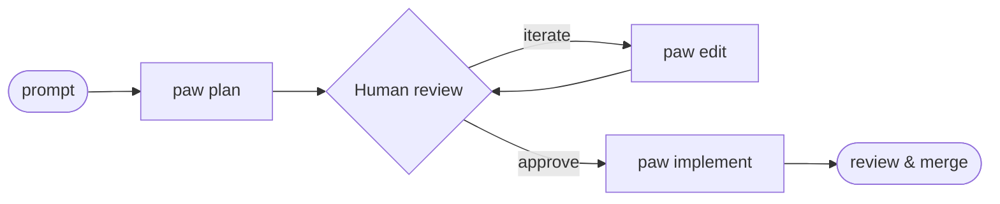

# Personal Agentic Workflow (PAW)

Implement/diagnose completion requires full local validation after final changes, including batch, GUI and docs-only tasks. See [validation policy and recorded evidence](examples/docs/testing.md).

[](https://github.com/levi-blodgett/personal-agentic-workflow/actions/workflows/tests.yml)
[](https://www.gnu.org/software/bash/)
[](https://github.com/levi-blodgett/personal-agentic-workflow)

> ## "You can outsource your thinking, but you can't outsource your understanding." - Andrej Karpathy

PAW is a plan-first, file-backed framework for AI-assisted development. The human owns scope review and commits; the agent implements inside an approved task package and leaves a local audit trail behind.

New task packages are stored in a local central task store by default:
`${PAW_TASK_HOME:-${XDG_STATE_HOME:-$HOME/.local/state}/paw/tasks}`. Existing repo-local `.agent/<task>/` packages remain supported and can be copied into the central store with `paw task-migrate [repo-path ...]`.



## Install

Install prerequisites: Git to obtain/update the checkout, make, Bash, and standard
macOS/Linux tools (`mkdir`, `ln`, `readlink`, `rm`). Task workflows also use Git,
`jq`, and standard shell utilities. Install your selected backend CLI and its
own dependencies separately. Python 3 is needed for the optional GUI; GitHub
helpers require `gh`. Contributors need Bats and ShellCheck for `make check`.

```bash
git clone https://github.com/levi-blodgett/personal-agentic-workflow.git
cd personal-agentic-workflow
make install
export PATH="$HOME/bin:$PATH"
paw help
paw model -v
```

Add the PATH export once to your shell startup file (for example `~/.zshrc`),
then open a new shell or source that file. `make install` creates a symlink; it
does not install dependencies or edit shell configuration. `paw model` reports
configuration, so it does not prove your provider is installed/authenticated or
that a model call will succeed.

`PREFIX` is the executable directory itself, defaulting to `$HOME/bin`:

```bash
make install PREFIX="$HOME/local bin"
export PATH="$HOME/local bin:$PATH"
make uninstall PREFIX="$HOME/local bin"
```

Run make from the checkout (or use `make -C "/path/to/checkout"`). Keep the
checkout in place: installed `paw` loads helpers from it. To upgrade, update
that checkout with Git and rerun `make install` using the same PREFIX. Repeated
install/uninstall succeeds; uninstall removes only the exact absolute link
created for this checkout, including when its launcher source has disappeared.

Files, directories, and foreign links are refused without replacement. On a
collision or after moving the checkout, inspect `ls -ld "$HOME/bin/paw"` and
`readlink "$HOME/bin/paw"` (substitute your PREFIX). Remove the old link manually
only after confirming it is safe, then install from the intended checkout.
Equivalent relative/chained links can launch PAW, but the installer deliberately
requires its own exact link target for ownership. Uninstall before deleting a
checkout; shell recipes do not protect against concurrent filesystem changes.

For separately maintained backends, follow the [plugin author guide](examples/docs/backends.md#external-plugin-backend-example)
and [copyable installer example](examples/backend-plugin/README.md).

### Optional zsh Completion

```bash
# Enable zsh subcommand completion
autoload -U compinit && compinit
source <(paw completion zsh)   # current shell
paw completion zsh >> ~/.zshrc # future shells
```

## Quick Start

```bash
# In any target repo, wire up local-only task tracking
paw setup

# Start a new task (plan-only run)
paw plan <task-name> "<prompt>"

# Implement / resume an approved task
paw implement <task-name>

# Review completed task quality, then optionally plan a replacement
paw review <task-name>
paw prototype <task-name>

# Hide a task from active task lists without deleting it
paw archive <task-name>

# Launch several approved, unblocked tasks at once
paw implement-batch <task-a> <task-b>

# Optional local dashboard
paw gui
paw gui start --all
paw gui restart
paw gui stop

# Optional legacy task migration
paw task-migrate
paw task-migrate ../other-repo ../third-repo

# Optional PR helpers after implementation
paw pr-submit <task-name>
paw pr-review <pr-number>
paw pr-address-comments <pr-number>

# Optional issue helpers
paw to-issues <task-name>
paw to-issues <task-name> --publish
paw issue-submit <task-name>
paw issue-review <issue-number>

# Optional same-day GitHub Actions triage
paw gh-actions-review
paw gh-actions-review --create-issue
```

`paw` defaults to the `codex` backend today. Shipped built-ins and helpers load from the resolved launcher checkout; `PAW_HOME` selects templates/instructions and resource paths passed to backends, and external backends remain separate executables on your `PATH` exposed as `paw-backend-<name>`. Switch backends with `PAW_BACKEND=<name>` when you need one of those built-ins (`claude` or the test-only `stub`) or an installed external plugin.

`paw completion zsh` prints a small `compdef` script for native `zsh` completion. Load it with `source <(paw completion zsh)` in the current shell, and append it to `~/.zshrc` for future shells. v1 is `zsh`-only and completes top-level subcommands only.

Implementation wrap-up uses targeted validation first: run the changed-area commands named in the task plan, record the validation tier and rationale in `plan.md`, then escalate to broader or full validation when risk warrants it. `make check` remains the canonical full-suite gate for PR-ready or high-risk handoffs.

`paw review <task-name>` launches a short task-quality review and records the reviewed scope, grade, optional overall workflow/subsystem grade, quality threshold comparison, architectural/design choices, production-readiness blockers, improvement notes, and recommendations in `review.md`.

In the GUI, **Use as Prototype** opens an optional-instructions dialog on both home and detail views. Review the source first; grades A- or higher disable prototyping. Planning creates or reuses a replacement package, with **Open replacement** and **Open source** links once discovery finds them. Both packages show the active operation and share available Stream/Cancel controls. Failed or interrupted planning offers an explicit retry from the source or editing of the replacement, with failure logs on task detail. Retry retains existing documents. After successful planning, open the replacement and **Approve Implementation**, then continue to Review. Cleanup warnings remain visible but do not block approval. Archive the used source separately; its replacement stays active. Open instructions dialogs survive routine polling.

Successful `paw implement` runs save a checksum-verified `prototype.patch` with full blob identities, result bytes, deletions and modes, plus baseline/index metadata and `paw.prototype-owned-path` entries. Pre-existing dirty paths are excluded; resumed runs invalidate previous cleanup authority. Missing or ambiguous evidence records `paw.prototype-provenance-status/message` instead. When a review calls for replacement, `paw prototype` creates the replacement plan first and exits zero when planning succeeds. Automatic cleanup requires the saved patch checksum, baseline and current content/modes to match, the entire index to equal the saved baseline, and no unowned tracked changes or untracked non-`.agent` files. It reverses the verified saved patch and checks the worktree/index postcondition. Legacy path-only metadata never authorizes cleanup. Blocked/unavailable cleanup preserves the replacement package and exposes a manual-follow-up reason through `paw.prototype-status` and `paw.prototype-cleanup-message`.

`paw browse <task-name>` opens the resolved task package's Markdown docs in the terminal, resolving central tasks before legacy `.agent/<task>/` packages; set `PAW_BROWSE_PAGER=cat` for plain stdout. `paw archive <task-name>` moves a central task package under that repo store's `.archive/` folder so normal CLI and GUI listings omit it.

GUI validation summarizes recorded checks in `plan.md` → **Validation Performed**. Gray **Unvalidated** means absent/context-only evidence; **Passed** requires explicit success without unresolved checks; **Attention** identifies failures or blocked checks; **Recorded** retains incomplete or uncertain checks. **Validation details** exposes complete escaped history and the exact plan source. Results do not establish current-run freshness or required-check completeness. See [outcomes, scope and exact per-check reruns](examples/docs/testing.md#recorded-validation-in-the-gui).

Validation details start collapsed on ordinary task navigation. Select the summary (or focus it and press Space) to expand the complete evidence; the aggregate badge stays visible. Dashboard **Validation details** links open the evidence directly. Polling refreshes records while preserving your open/closed choice. Homepage rendering shares task discovery and metadata reads within each request; subsequent visits and polls read current task data.

`paw gui` starts a local task dashboard on `127.0.0.1:8765` in the foreground by default; pass `--port 0` when you explicitly want an ephemeral localhost port. It renders task Markdown as safe HTML, sorts tasks newest-first by recent run or task metadata, keeps the index and task detail views fresh with local polling, hides state/repo/completion filters by default, and presents each task as a Stage/Next workflow with a primary control for the next eligible step. Open **Manage repos → Add repo path** to register another existing local Git repo, then select **Active repo** (one selection with JavaScript; **Switch** remains the no-JavaScript fallback) to change the scoped central-plus-legacy task list and the target repo for new Plan actions without restarting the server. The local repo registry lives at `${XDG_STATE_HOME:-$HOME/.local/state}/paw/gui/repos.gitconfig`; `--repo <path>` seeds the startup/default repo. Reviewed tasks show their non-pending `review.md` grade as a color-coded badge in the `Next` column; reviewed-task prototype controls are labelled `Use as Prototype`, and grades of `A-` or higher disable GUI prototype actions. The dashboard uses a compact Home/Archived/title header, a responsive wide shell, scrollable dense tables, and expandable path details so full repo/task/store paths remain available without dominating the view. Task names open details. Row utilities include Edit/Answer Questions and `plan.md` preview; amber **Archive** sits directly beside red **Delete** below them. Implementation approval appears in **Next** and on task detail. Task detail groups verbose metadata under **Task metadata** while keeping workflow warnings visible. Tasks with saved PAW branch metadata and an existing local branch also show `View PR`; clicking it looks up the current PR with `gh pr view <branch>` and shows an inline PR link on the dashboard (also inline on task detail), without creating or editing remote state. Lookup errors distinguish missing `gh`, authentication/configuration failures, no matching PR, invalid URLs, and other CLI failures; authentication and API/network errors retain the CLI diagnostic. Implementation-ready tasks show `Approve Implementation`, which opens an in-window `plan.md` preview with controls to run `paw edit`, inspect the manual `plan.md` path, or approve the unchanged `paw implement` launch. The compact toolbar puts **New Plan** beside repo context and a **Queued Plans (count)** link to the editable queue in the same overlay. New Plan explicitly shows its destination repo. Selecting eligible tasks reveals their count and adjacent **Archive selected / Delete selected** controls; only Delete reveals confirmation. Without JavaScript, the selected-action dropdown and Apply form remain available. Plan prompts can also be queued locally from the Plan overlay, edited later in that overlay (task name and prompt), displayed in full with line breaks preserved, triggered through the normal `paw plan` flow, or removed. Running tasks with live PID-bearing PAW run metadata and matching GUI-created stdout/stderr logs show `Stream` to the left of `Cancel`; the task detail page also embeds a polling live log panel, and the standalone stream page tails bounded task-local logs under `runs/`. Pidless or stale running metadata remains blocked instead of exposing unsafe process signalling or log guesses. The Archived header link opens central `.archive` packages for the current scope, where they can be unarchived when no active package would be overwritten. GUI actions collect optional plan/edit/review/prototype instructions in overlays where needed, launch implementation without GUI extras after approval, and delete a resolved task package only after confirmation plus exact path match. CLI `paw implement-batch` remains available for concurrent approved implementation, but the GUI no longer exposes selected mass implementation. Blocked tasks with `USER ANSWER` placeholders expose an `Answer Questions` edit overlay that displays parseable pending questions and passes submitted answers to `paw edit`; the GUI does not write answers directly into `plan.md`. `paw gui start` runs it in the background, records PID/URL metadata under `${XDG_STATE_HOME:-$HOME/.local/state}/paw/gui/`, and `paw gui restart` replaces only that recorded PAW GUI process while reusing its recorded host, port, repo, task-home, and `--all` mode unless options override them. `paw gui stop` or `paw gui kill` stops only that recorded PAW GUI process. Add `--all` to show every central task store grouped by repo identity; in that mode the Active repo dropdown still controls where new Plan actions launch. The GUI never replaces `contract.md`, `plan.md`, `review.md`, or `runs/` logs as the source of truth.

Live polling preserves eligible task selections, open disclosures and overlays, draft input, focus/caret, and page/table/document scroll while refreshing changed task data. stdout and stderr keep independent scroll positions: new output follows only when that panel was already at the bottom. Reading older output stops following; bounded-tail truncation can remove older content. Log polling continues as runs appear or change. State lasts for the current page, not across a deliberate reload or explicit repo navigation. Previews and input overlays close with Close, Escape, or a backdrop click; interacting inside keeps them open. Focus enters and stays in the labelled dialog, returns to its opener (or a stable navigation fallback), and background scrolling is restored on dismissal. Unsent input survives dismissal/reopening and polling. Closing a pending action does not cancel it; its result remains in dashboard feedback. A dismissed or replaced preview ignores late responses.

Dashboard actions stay inline, including Plan/Queue, Edit/Answer Questions, approval previews, Review, Use as Prototype, Archive/Delete/Cancel, selected actions, queue editing/removal, Add repo, and View PR lookup. Feedback reports launch acceptance, not subprocess completion. Filters and the active repo remain selected; successful Add repo switches to that repo. A pending submission blocks overlapping submissions and freezes its submitted inputs until the result arrives, including after dismissal/reopening. Errors retain drafts for deliberate retry; after an uncertain network result, check task state before retrying. Task names, Stream, Home, Archived, and the returned PR link remain explicit navigation links. Ordinary POST fallback remains available; task-detail actions also show inline feedback with JavaScript.


## Documentation

- [examples/docs/workflow.md](examples/docs/workflow.md) — end-to-end workflow, task-package contract, review gates, and operational constraints
- [examples/docs/cli-reference.md](examples/docs/cli-reference.md) — complete `paw` subcommand reference, Makefile targets, and runtime behavior
- [examples/docs/architecture.md](examples/docs/architecture.md) — repo layout and how templates, examples, and local `.agent/` state fit together
- [examples/docs/testing.md](examples/docs/testing.md) — canonical validation entrypoints and test-suite notes
- [examples/docs/backends.md](examples/docs/backends.md) — backend selection, model behavior, and streaming details
- [scripts/README.md](scripts/README.md) — CLI subcommands, helper scripts, and environment variables
- [tests/README.md](tests/README.md) — canonical validation entrypoints and bats suite notes
- [scripts/lib/README.md](scripts/lib/README.md) — shared helpers and backend modules

### Implementation handoff and review grades

Replacement planning creates a plan for a later `paw implement` run. Once approved
implementation, documentation, tests and final full validation pass, record 100%
and `Next work: Review.`. Independent grading and inherited production quality
thresholds belong in the subsequent Review stage; 100% describes implementation
completion, not production sign-off. Self-checks and genuine blockers remain part
of implementation. Reconcile explicit conflicting old approved gates per task;
existing task histories are not automatically rewritten.

Reviews should write plain metadata, for example `- Grade: B+` under
`## Review Metadata`, with explanations and threshold results in separate fields.
The GUI also reads case-insensitive A/B/C/D/F grades with optional plus/minus,
one balanced bold, italic or backtick wrapper, and an optional final period.
Supported grades share badge text, color and prototype eligibility (A- or higher
blocks prototype). Pending/empty grades have no badge; unsupported values remain
escaped neutral text without a guessed rank. Review files are preserved.

New plans use the [A- quality rubric and acceptance-evidence guide](examples/docs/quality.md). [Review completion and inheritance](examples/docs/cli-reference.md#review-completion-and-inherited-findings) describes pending-review recovery, preserved attempts, archived source lookup, and CLI/GUI eligibility distinctions.
