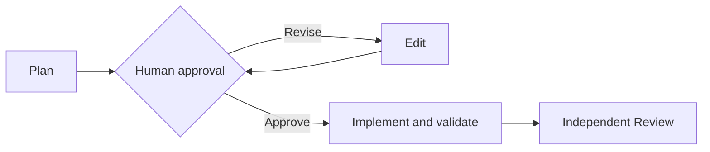

# Personal Agentic Workflow (PAW)

[](https://github.com/levi-blodgett/personal-agentic-workflow/actions/workflows/tests.yml)

PAW turns a request into a local, reviewable plan that an AI agent implements inside human-approved scope; you own the final diff and commits.



## Install

On macOS or Linux, install Git, make, Bash, jq and your backend CLI separately.
PAW defaults to Codex; [backend setup](examples/docs/backends.md) covers alternatives.
Python 3 is needed for the optional GUI; GitHub helpers need authenticated `gh`.

```bash
git clone https://github.com/levi-blodgett/personal-agentic-workflow.git
cd personal-agentic-workflow
make install
export PATH="$HOME/bin:$PATH" # also add once to your shell startup file
paw help
paw model -v
```

Keep the checkout: installation creates a symlink into it. `paw model` reports
configuration; it does not verify provider authentication or execution.
See [installation](examples/docs/install.md) for upgrades, custom PREFIX and recovery.
For optional zsh completion, use `source <(paw completion zsh)`;
[completion setup](examples/docs/install.md#optional-zsh-completion) persists it.

## Quick Start

Run in the target repo and branch/worktree you want to use:

```bash
paw setup
paw plan add-version "Add a --version flag with a behavior test."
paw browse add-version      # read the plan
paw edit add-version "Clarify the version output format."
# Review and approve the reconciled plan before implementation:
paw implement add-version
paw review add-version
paw gui                    # optional local dashboard
```

PAW records existing branch/worktree assignments; it does not create them.
New tasks use `${PAW_TASK_HOME:-${XDG_STATE_HOME:-$HOME/.local/state}/paw/tasks}`;
legacy `.agent/<task>/` packages still resolve. [Workflow](examples/docs/workflow.md)
covers answers, migration, replacement plans and safe cleanup.

Implementation and diagnose completion require final full local validation,
including batch, GUI and docs-only tasks. For PAW itself, run
`PYTHONDONTWRITEBYTECODE=1 make check`; see [validation and recorded evidence](examples/docs/testing.md).
100% / `Review.` means implementation is complete; independent Review and
production sign-off follow. New plans target [A- with no blockers](examples/docs/quality.md),
while explicit inherited thresholds remain authoritative.

## Documentation

| Guide | Use it for |
|---|---|
| [Install](examples/docs/install.md) | Ownership, upgrades, completion and recovery |
| [Workflow](examples/docs/workflow.md) | Plan → approval → implementation → review/replacement |
| [GUI](examples/docs/gui.md) | Repos, queue, approvals, logs and interaction limits |
| [CLI reference](examples/docs/cli-reference.md) | Commands, options and troubleshooting |
| [Backends](examples/docs/backends.md) | Selection, streaming and external plugins |
| [Testing](examples/docs/testing.md) / [Quality](examples/docs/quality.md) | Validation evidence and independent Review |
| [Architecture](examples/docs/architecture.md) | Components, storage and contributor navigation |
| [Test suite](tests/README.md) | Runnable suites, fixtures and browser harness |
