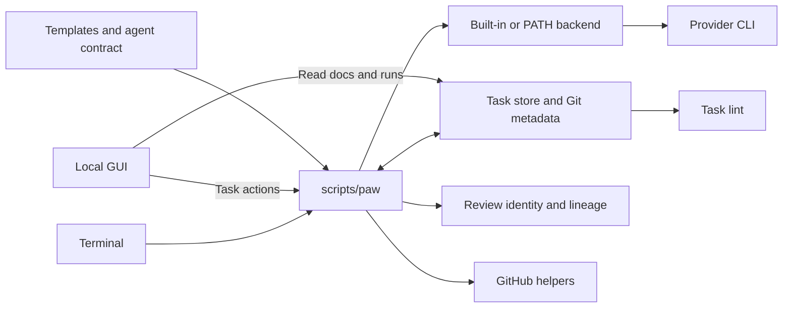

# Architecture

## Component Overview

Terminal path: dispatcher → shared guards/prompt helpers → backend → task docs/results.
GUI actions use that CLI boundary; local task data remains authoritative.

## Where Things Live

| Path | Responsibility |
|---|---|
| [scripts/paw](../../scripts/paw) | Command/model tables, prompt assembly, assignments, review/prototype orchestration |
| [scripts/lib](../../scripts/lib/README.md) | Task-store, GUI, evidence, review/lineage and backend boundaries |
| [backends](../../scripts/lib/backends/README.md) / [interface](../../scripts/lib/backends/_iface.md) | Built-in shell modules and external executable protocol |
| [prompts](../../prompts/README.md) | Operational agent contract; not ordinary editorial prose |
| [templates](../../templates/README.md) | Empty task/branch PR skeletons |
| [examples](../README.md) | Filled task example, installer example and human guides |
| [tests](../../tests/README.md) / [fixtures](../../tests/fixtures/README.md) | Hermetic CLI/Python checks and isolated browser journeys |
| [Makefile](../../Makefile) | Installation and full local `make check` entrypoint |
| [.github/workflows/tests.yml](../../.github/workflows/tests.yml) | Main pushes/PRs: Bats, ShellCheck and canonical sample-fixture lint |

CI runs those three checks explicitly; local `make check` lints repo task packages.
The browser harness is an additional explicit command, not part of either default gate.

## Repo Structure

| Local state | Contents / authority |
|---|---|
| `${PAW_TASK_HOME:-${XDG_STATE_HOME:-$HOME/.local/state}/paw/tasks}/<repo-slug>/<task>/` | contract/plan/review Markdown, provenance metadata and run logs |
| Same repo store, `v2-<prefix>-<sha256>-pr.md` | Branch body seeded when a repo has a PR template; legacy task `pr.md` fallback |
| Same repo store, `.archive/<task>/` | Archived central packages, omitted from active listings |
| `.agent/<task>/` | Legacy fallback, excluded locally with `paw setup` |
| `${XDG_STATE_HOME:-$HOME/.local/state}/paw/gui/active.gitconfig` | Managed GUI PID/URL/options/log paths |
| Same GUI directory, `repos.gitconfig` | Local registered Git repo paths |
| Git common-dir metadata | Existing task branch/worktree assignment shared by sibling worktrees |

Slugged stores distinguish repo identities; central packages precede legacy matches.
`metadata.gitconfig` records provenance and `runs/*.gitconfig` observational sessions;
neither replaces Markdown. The GUI presents friendly repo grouping over these paths.
See [storage/assignment rules](workflow.md#architecture-of-workflow) and [GUI controls](gui.md).
