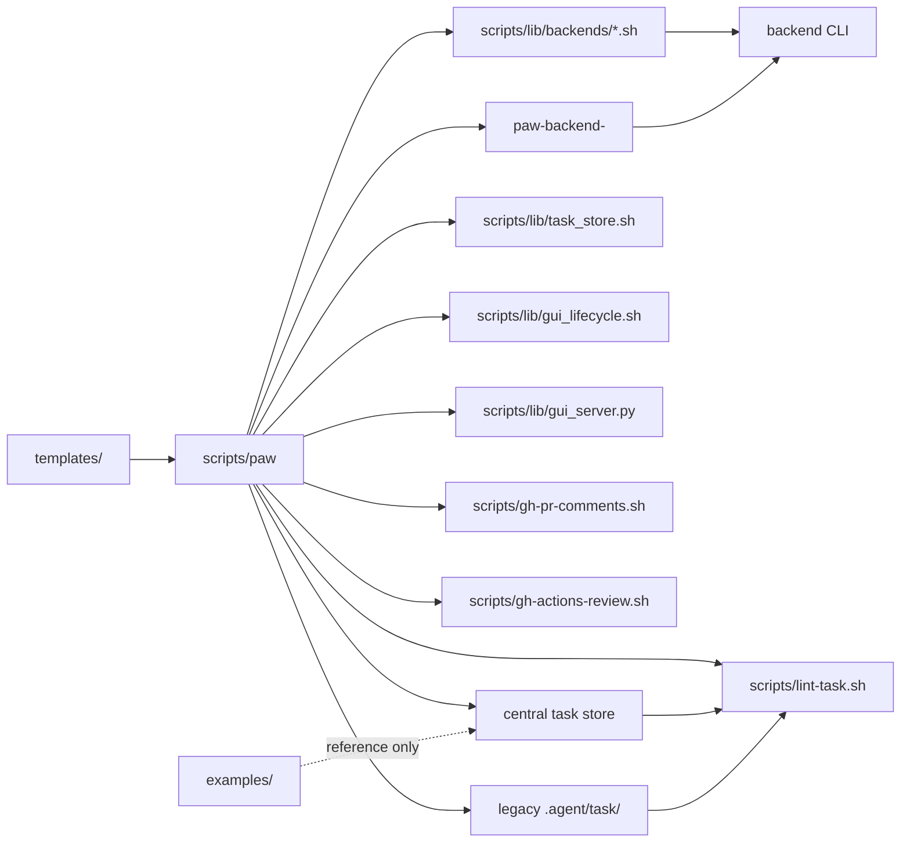

# Architecture

Repo structure, file layout, and the relationship between task templates, committed examples, and runtime task state.

## Where Things Live

| Area | Purpose | Details |
|------|---------|---------|
| `scripts/` | CLI and helper scripts | See [`scripts/README.md`](../../scripts/README.md) and [`scripts/lib/README.md`](../../scripts/lib/README.md) |
| `scripts/lib/backends/` | Built-in AI backends | See [`scripts/lib/backends/README.md`](../../scripts/lib/backends/README.md) and [`scripts/lib/backends/_iface.md`](../../scripts/lib/backends/_iface.md) |
| `templates/` | Task-doc skeletons | See [`templates/README.md`](../../templates/README.md) |
| `tests/` | bats test suite | See [`tests/README.md`](../../tests/README.md) |
| `tests/fixtures/` | Test input packages | See [`tests/fixtures/README.md`](../../tests/fixtures/README.md) |
| `prompts/` | Workflow contract loaded into every agent run | [`prompts/prompt_instructions.md`](../../prompts/prompt_instructions.md) |
| `examples/` | Committed examples and durable operator docs | See [`examples/README.md`](../README.md) |
| `examples/docs/` | Durable operator documentation | This directory |
| `${PAW_TASK_HOME:-${XDG_STATE_HOME:-$HOME/.local/state}/paw/tasks}/<repo-slug>/<task>/` | Default local task store | Markdown task package plus local metadata; never committed |
| `${XDG_STATE_HOME:-$HOME/.local/state}/paw/gui/active.gitconfig` | Managed GUI lifecycle state | PID, URL, logs, repo path, task home, and start time for `paw gui start`; never committed |
| `.agent/<task>/` | Legacy local-only task docs | Still resolved for compatibility; excluded via `.git/info/exclude`; never committed |

## Component Overview



## Repo Structure

```text
personal-agentic-workflow/
├── Makefile                              — operator entrypoint (make help for target list)
├── README.md                             — quick start plus durable docs index
├── .github/
│   ├── pull_request_template.md          — repo PR template; causes local tasks here to seed `pr.md`
│   └── workflows/
│       └── test.yml                      — CI: make check on pushes and pull requests
├── prompts/
│   ├── README.md                         — prompt-contract directory overview
│   └── prompt_instructions.md            — master workflow contract loaded into every agent run
├── examples/
│   ├── README.md                         — committed examples overview
│   ├── docs/
│   │   ├── workflow.md                   — workflow architecture, day-to-day flow, review checklist
│   │   ├── cli-reference.md              — paw subcommands, environment overrides, and runtime notes
│   │   ├── architecture.md               — repo structure tree and file layout (this file)
│   │   ├── testing.md                    — validation entrypoints and test-suite notes
│   │   └── backends.md                   — PAW_BACKEND configuration, models, and streaming
│   └── example-task/
│       ├── contract.md                   — example contract document
│       ├── plan.md                       — example plan and progress log
│       └── pr.md                         — example PR description
├── scripts/
│   ├── README.md                         — scripts overview plus env var reference
│   ├── paw                               — CLI wrapper and dispatcher
│   ├── setup-repo.sh                     — add `.agent/` to a target repo's `.git/info/exclude`
│   ├── list-tasks.sh                     — list central and legacy task packages plus current status
│   ├── lint-task.sh                      — verify central or legacy task packages against the contract
│   ├── gh-pr-comments.sh                 — list unresolved PR review comments via GitHub GraphQL
│   ├── gh-actions-review.sh              — inspect same-day GitHub Actions failures
│   └── lib/
│       ├── README.md                     — helper overview and backend module notes
│       ├── crash_log.sh                  — crash classification and append helpers
│       ├── task_store.sh                 — central/legacy task path resolution, metadata, and migration helpers
│       ├── gui_lifecycle.sh              — local PID/URL metadata and stop/kill helpers for `paw gui start`
│       ├── gui_server.py                 — stdlib local HTTP server for `paw gui`
│       ├── prompt_optimizer.sh           — optional `paw plan` prompt pre-optimizer
│       ├── claude_invoke.sh              — backwards-compat shim for `backends/claude.sh`
│       └── backends/
│           ├── README.md                 — backends overview plus extension guidance
│           ├── _iface.md                 — backend contract
│           ├── claude.sh                 — Anthropic CLI backend
│           ├── codex.sh                  — default backend: wraps `codex exec`
│           └── stub.sh                   — test-only backend: writes argv/prompt to BATS_TEST_TMPDIR
├── templates/
│   ├── README.md                         — template conventions and task-package rules
│   ├── contract.md                       — empty `contract.md` skeleton
│   ├── plan.md                           — empty `plan.md` skeleton
│   └── pr.md                             — empty `pr.md` skeleton
└── tests/
    ├── README.md                         — how to run the bats test suite
    ├── fixtures/
    │   ├── README.md                     — fixture conventions
    │   ├── backend-plugins/              — executable backend-plugin fixtures
    │   ├── gh-pr-comments/               — JSON responses for `gh-pr-comments.bats`
    │   ├── sample-task-bloated/          — plan exceeds the working-surface budget
    │   ├── sample-task-missing-sections/ — intentionally incomplete task package
    │   └── sample-task-valid/            — canonical passing task package
    ├── helpers/
    │   ├── exit_code.bash                — bats exit-code assertion helper
    │   └── hermetic.bash                 — locale/timezone/env sanitiser for hermetic runs
    ├── gh-actions-review.bats            — `gh-actions-review.sh` dispatch and triage coverage
    ├── gh-pr-comments.bats               — `gh-pr-comments.sh` coverage
    ├── lint-task.bats                    — `scripts/lint-task.sh` coverage
    ├── list-tasks.bats                   — `scripts/list-tasks.sh` coverage
    ├── task-store.bats                   — central task-store resolver and explicit multi-repo migration coverage
    ├── gui-server.bats                   — local dashboard lifecycle and multi-repo display coverage
    ├── makefile.bats                     — smoke tests for every Makefile target
    ├── paw-codex.bats                    — codex backend coverage
    ├── paw-compact.bats                  — `paw compact` archive-on-tick and idempotency
    ├── paw-completion-docs.bats          — durable-doc coverage for `paw completion zsh`
    ├── paw-crash.bats                    — crash logging and prompt-size warning coverage
    ├── paw-dispatcher.bats               — `scripts/paw` subcommand dispatch and launcher behavior
    ├── paw-gh-actions-workflow.bats      — shell-side `paw gh-actions-review` coverage
    ├── paw-issue-workflow.bats           — shell-side issue workflow coverage
    ├── paw-pr-workflow.bats              — shell-side PR workflow coverage
    ├── paw-prompt-body.bats              — prompt body and launch banner coverage
    ├── setup-repo.bats                   — `scripts/setup-repo.sh` coverage
    └── templates.bats                    — template structure and prompt-anchor guarantees
```

The [`examples/example-task/`](../example-task/) directory is still useful even though `templates/` exists: `templates/` shows the empty canonical skeleton, while `examples/` shows what a completed task package looks like after real checklist progress, validation logging, and handoff notes have accumulated. Real task packages now live in the central local task store by default, while existing `.agent/<task-name>/` directories still resolve as legacy local-only packages.

Central-store task packages keep Markdown authoritative. `metadata.gitconfig` records local provenance, and `runs/*.gitconfig` records observational run/session state for PAW runs; neither file replaces `contract.md`, `plan.md`, or `pr.md`.

The slugged central store remains canonical because it handles duplicate repo names and worktrees better than a plain `paw/.agent/<repo>/<task>` tree. The GUI presents the friendlier repo-to-task grouping: scoped mode combines one repo's central and legacy tasks, while `--all` enumerates all central repo slugs and displays repo name, path, branch/head state, slug, source, and task path. Browser actions stay local-only and delegate to `scripts/paw` for plan/edit/implement so CLI prompt and assignment semantics remain authoritative. Guarded deletion resolves the target from the same task listing, requires exact task-name confirmation, rejects stale paths, and removes only that task directory.
