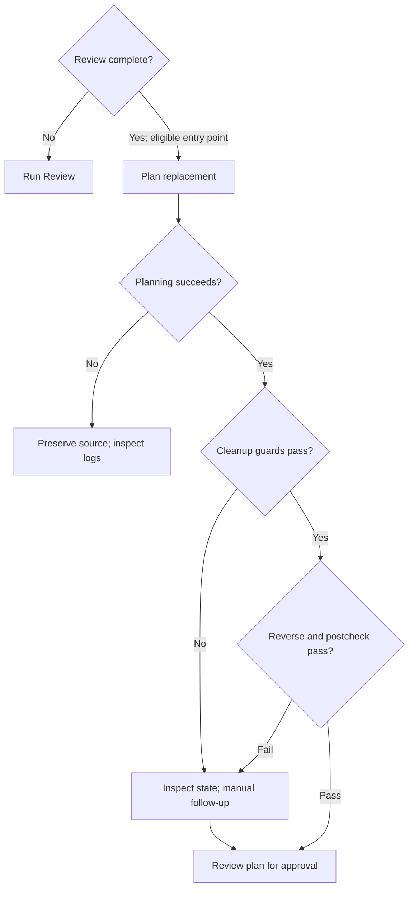

# Review and prototype lifecycle

[Back to workflow](workflow.md).

## Review completion and inherited findings

New plans follow [Quality policy version 1](quality.md): A- / no production
blockers at independent Review, a criterion/check/evidence table, and bounded
risk-specific self-checks before final full validation. Explicit inherited thresholds
remain authoritative. Unversioned plans are not retroactively rejected.

`paw review` alone seeds [templates/review.md](../../templates/review.md), selected
from `$PAW_HOME/templates/review.md`, for central and legacy packages. Plan and
prototype creation do not seed reviews. Loading and validating the required runtime
slots, pending metadata and section shape precedes any review/history/attempt
mutation; missing, unreadable or malformed resources stop before backend launch
with the resource path. There is no embedded fallback skeleton.

Fill the template's verdict, blockers, evidence, design, improvements and recommendations.
Keep seeded identities unchanged; record the review date and threshold source.
Broader workflow grades and cleanup assessments need a scope reason when unassessed.
Use stable finding IDs and retain inherited origins and resolution evidence; recommendations
reference those IDs. Separate inspected historical outcomes from fresh review checks,
including named commands, tiers, logs and code identities. Missing original logs and
failed checks stay visible; only explicit successful same-name reruns supersede failures.
The [filled review](../example-task/review.md) is hypothetical, not PAW validation evidence.
These producer conventions do not add requirements to accepted historical records
or change the separate GitHub `paw pr-review` comment-draft format.

Review completion requires matching task identity, resolved scope, a recognized
grade, explicit threshold/result and a blockers disposition (list or None). New
attempts also carry policy version, attempt and reviewed code identity, and an
explicit completion marker. A backend returning zero with pending content fails;
failed/interrupted attempts cannot reuse prior success. `paw review` preserves prior
bytes in collision-safe `review-history/` files before seeding a fresh attempt;
archival failure stops without overwriting the prior review. Legacy records remain
readable, but incomplete records need **Run Review** before replacement planning.
Completion checks establish structure, not truth, coverage or production sign-off.

CLI prototype accepts complete adverse reviews and explicit complete high-grade
requests. GUI row/detail/POST additionally restrict A- or higher; that existing
product distinction remains. Pending, unknown-grade, stale and interrupted reviews
cannot authorize replacement seeding or cleanup. Source evidence is checked again
before cleanup; changed evidence stops the run. Existing cleanup ownership,
content/index and idle-worktree guards still apply.

Replacement prompts resolve same-repo sources and ancestors from active central,
archived central or legacy packages. Recorded paths must match repo/task identity;
missing, ambiguous, escaped or cross-repo evidence and lineage cycles block planning.
Archive moves preserve source content. Each blocker needs a finding → invariant →
acceptance/test mapping; non-blockers need planned, deferred-with-reason or
resolved-with-evidence dispositions. Preserve all origins when deduplicating shared
findings. A better grade never silently resolves a blocker; scope conflicts require
reconciliation. Missing evidence never authorizes discarding retained source work.

| Source review | CLI prototype | GUI row/detail/POST |
|---|---|---|
| Missing, pending, malformed, stale, interrupted or unknown grade | Refuse | Run Review; refuse prototype |
| Complete adverse review below A- | Allow replacement planning | Allow replacement planning |
| Complete A- or higher, explicit replacement request | Allow | Disable/refuse |

### Prototype cleanup

Planning success and cleanup success are separate: `paw prototype` exits zero
when planning succeeds, including blocked/unavailable cleanup. A cleanup failure
must remain visible and does not erase the replacement plan or grant permission
to discard retained source work.

- Successful `paw implement` runs save a checksum-verified `prototype.patch` with full blob identities, result bytes, deletions and modes, plus baseline/index metadata and `paw.prototype-owned-path` entries. Pre-existing dirty paths are excluded; resumed runs invalidate previous cleanup authority. Missing or ambiguous evidence records `paw.prototype-provenance-status/message` instead. Provenance statuses are `recorded`, `no-owned-paths`, `blocked`, and `unavailable`. The local manifest uses `paw.prototype-patch-hash`, `paw.prototype-patch-head`, and `paw.prototype-index-contract=baseline-v1`.
- Metadata keys `paw.prototype-source`, `paw.prototype-review`, `paw.prototype-status`, and `paw.prototype-cleanup-message`, and the source’s `paw.prototype-replacement` path let the GUI show lineage and cleanup state without parsing Markdown.
- `paw prototype` creates the replacement plan first and exits zero when planning succeeds. Automatic cleanup requires the saved patch checksum, baseline and current content/modes to match, the entire index to equal the saved baseline, and no unowned tracked changes or untracked non-`.agent` files. It reverses the verified saved patch and checks the worktree/index postcondition. Legacy path-only metadata never authorizes cleanup. Blocked/unavailable cleanup preserves the replacement package and exposes a manual-follow-up reason through `paw.prototype-status` and `paw.prototype-cleanup-message`. Replacement statuses are `planned-source-reverted`, `planned-revert-blocked`, or `planned-revert-unavailable`; source statuses omit `planned-`.
- Supported cleanup includes tracked binary content, deletions, executable modes, spaces, tabs, Unicode, quotes and literal pathspec characters. Newline paths, symlink/directory results, content-normalizing attributes or enabled `core.autocrlf`, staged changes, and ambiguous renames block. Git enumeration or metadata failures never grant cleanup permission.
- For manual recovery, inspect `prototype.patch`, `git diff`, and `git diff --cached`; preserve unrelated edits and remove only reviewed source changes. Never populate path-only metadata to force cleanup. Keep the worktree idle during capture/cleanup: ordinary Git worktree edits cannot be transactionally locked.
