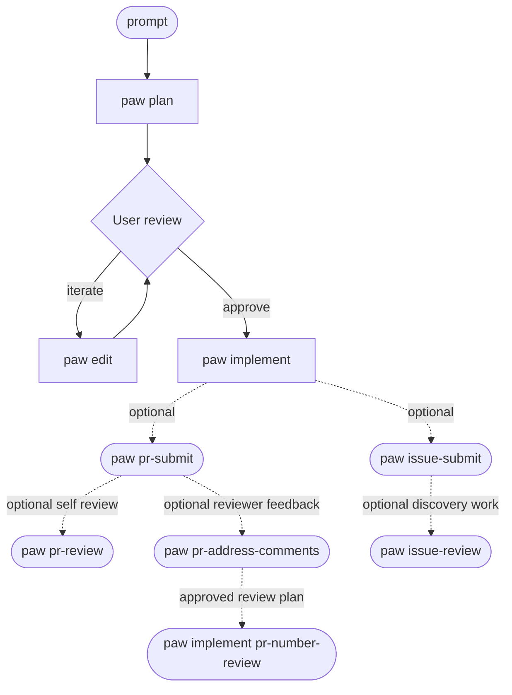
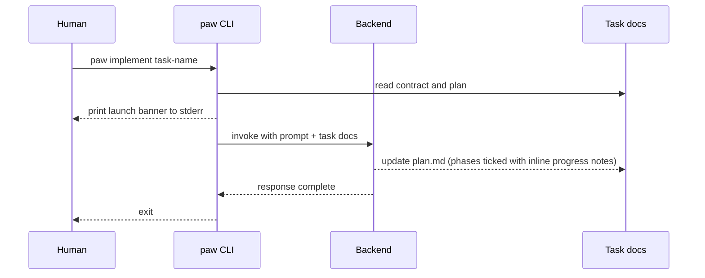

# Workflow

How PAW works end-to-end: task-package shape, day-to-day flow, review expectations, and the operational constraints that keep planning and implementation separate.

## Architecture of Workflow

Shared workflow instructions live in this repo, at:
```text
$HOME/git/personal-agentic-workflow/prompts/prompt_instructions.md
```

This is the master workflow contract used across repos.

Repo-local task docs live inside each target repo:
```text
$HOME/git/<repo-name>/.agent/<task-name>/
  contract.md
  plan.md
  pr.md   # seeded when the repo has a PR template
```

Repo-local `.agent/` directories should be excluded locally via `.git/info/exclude`, not committed `.gitignore`. To set this up in a target repo, run either:

```bash
$HOME/git/personal-agentic-workflow/scripts/paw setup            # in the target repo
# or
$HOME/git/personal-agentic-workflow/scripts/setup-repo.sh        # equivalent direct call
```

## Overall Workflow



1. Open session in `tmux` on the machine you run the agent on.
2. Move into the existing branch/worktree you want the task tied to. `paw` records that current assignment during `paw plan`; it does not create branches or worktrees for you.
3. Ensure repo-local `.agent/` is excluded — run `paw setup` once per repo.
4. Run `paw`:
   - **Plan new work** — `paw plan <task-name> "<prompt>"`; planning orients from repo landmark files directly and, when run inside a Git worktree, records the task's current branch/worktree assignment in local Git metadata shared by sibling worktrees
   - **Iterate on plan** — `paw edit <task-name>` (plan-only, after `paw plan`); resumes the saved assignment when that is safe and is the required reconciliation step after the user fills in follow-up answers
   - **Implement approved task** — `paw implement <task-name>` (optionally with extra prompt text); resumes the saved assignment when that is safe, but refuses to run while `plan.md` still contains `USER ANSWER (UNRESOLVED):` or `USER ANSWER (PROVIDED):` placeholders
   - **Draft tracer-bullet issues from approved work** — `paw to-issues <task-name>`; reuses the saved assignment, writes a reviewable numbered breakdown to `.agent/<task>/issues/index.md`, and keeps one issue draft per slice under `.agent/<task>/issues/*.md`
   - **Publish reviewed issue drafts** — `paw to-issues <task-name> --publish`; submits the saved draft files in dependency order, fills in per-draft issue metadata, and syncs aggregate issue tracking back into `plan.md`
   - **Submit a draft PR** — `paw pr-submit <task-name>`; reuses the saved assignment, requires `.agent/<task>/pr.md`, and records the created PR number back into `plan.md` and `pr.md`
   - **Submit a GitHub issue** — `paw issue-submit <task-name>`; reuses the saved assignment, requires an on-demand `.agent/<task>/issue.md`, and records the created issue number back into `plan.md` and `issue.md`
   - **Draft a GitHub review from saved comments** — `paw pr-review <pr-number>`; first run writes `.agent/<task>/review.md`, later runs submit that saved draft comment
   - **Plan from an open GitHub issue** — `paw issue-review <issue-number>`; seeds `.agent/<issue-number>-issue-review/`, refreshes `issue.md` from the live GitHub issue, and runs a plan-only pass from the issue body only
   - **Address PR review comments with an AI plan** — `paw pr-address-comments <pr-number>` (creates plan), then `paw implement <pr-number>-review` (executes)
5. Review the resulting task package before implementation, then review the final diff before you commit.

## What The Task Package Owns

- `contract.md` captures the request, constraints, repo context, and assumptions.
- `plan.md` is the single working surface for planning and implementation progress.
- Non-trivial work should use as many implementation phases or vertical slices as needed; do not compress substantial scope into a single checkbox.
- Follow-up questions that need user input should be written as:
  `- <question>`
  `  - USER ANSWER (UNRESOLVED):`
  When the user replies, change that line to `USER ANSWER (PROVIDED): <answer>` and run `paw edit <task>` so the plan is reconciled before implementation.
- Completed checklist items must gain an adjacent `Progress:` line in the same edit before the agent moves on; `paw lint` enforces that for the `Implementation Phases / Checklist` section.
- `pr.md` is seeded only when the repo has a pull-request template. This repo now ships one, so local tasks here include `pr.md` by default.
- When task plans or workflow docs mention TDD, the canonical expectation is red-green-refactor: write one behavior-focused failing test, make that single test pass with one implementation step, repeat, and defer test-cleanup refactors until the implementation loop is complete. Tests should fail only when behavior changes, not when code is cleanly refactored.

### Branch and worktree assignment

- `paw plan` records the current Git context for the task in the repo's Git common dir, so later `paw edit` / `paw implement` / `paw to-issues` / `paw pr-submit` / `paw issue-submit` / `paw pr-review` runs can find the same assignment from sibling worktrees.
- `paw` never creates branches or worktrees. It only records the branch/worktree you were already using when the task was planned.
- If the saved task lives in another registered worktree of the same repo, `paw` re-execs from that worktree path after confirming your current worktree is clean apart from local `.agent/` docs.
- If switching would require clobbering dirty state, auto-detaching HEAD, inventing a branch, or hopping into another repo, `paw` stops and tells you what to fix manually.

### A `paw implement` run in detail



## Strengths

1. **User ownership** — the user approves the plan before any implementation runs; the AI cannot exceed the approved scope.
2. **Enforced contract** — `paw lint` checks that every required `plan.md` section is present, `## Current Status` contains the required fields, every completed implementation checkbox has an adjacent `Progress:` line, and the working surface stays ≤ 350 lines (default-on; disable with `PAW_LINT_LENGTH=0`).
3. **Strong paper trail** — `contract.md`, `plan.md`, and optional `pr.md` live beside the code while the task is in flight; the agent's rationale, decisions, checklist progress, and validation trail are captured locally without polluting committed project docs.
4. **Fast resume** — any new agent run starts from the task docs; no context is lost between sessions.
5. **Consistent terminal output** — AI-backed `paw` subcommands print the same `Launching: paw <sub> (PAW_BACKEND=… model=… stream=…)` banner, making it easy to see which backend and model is about to run.
6. **Shellcheck CI + lint** — every push runs shellcheck over all scripts and lints the canonical fixture; regressions are caught automatically.
7. **Pluggable backend** — swap the AI backend with `PAW_BACKEND=<name>` without changing any other code. `codex` is the default backend; `claude` and `stub` ship in-repo, and private or separately distributed backends can install as external plugins.

## Weaknesses

- **Prompt overhead** — loading `prompts/prompt_instructions.md` + task docs on every run is heavier than simpler prompt approaches. Prompt caching reduces the marginal overhead but the fixed input surface remains. The working surface is capped at ≤ 350 lines and a bats regression test (`templates.bats`) enforces this automatically so silent growth is caught. Use `paw model` and [`docs/backends.md`](backends.md) to verify the current backend-specific model behavior.
- **Concurrency** — running multiple agents on the same repo concurrently is unsupported. Use [git worktrees](https://git-scm.com/docs/git-worktree) (`git worktree add ../repo-feature feature-branch`) to run one agent per worktree and merge back; `.agent/` dirs inside each worktree stay local-only. Multi-repo parallel agents work natively (watch rate limits).
- **Backend coverage is still narrow** — the pluggable architecture is in place, but only three backends ship in-repo (`codex`, `claude`, `stub`) and broader third-party coverage (`ollama`, `openai`, `gemini`, …) is still deferred.
- **Cross-repo coordination** — each task lives inside one repo; multi-repo refactors require manual hand-off between task packages. Deferred.

## Troubleshooting Crashes

When `paw` or the active backend CLI fails, a crash record is automatically written to `.agent/<task>/crash.log`. Read it with:

```bash
paw crash-log <task-name>
```

Each record includes a `classification:` line that names the likely cause:

| Classification | Likely cause | Fix |
|---|---|---|
| `content_filter` | Output blocked by content policy or moderation system (this was previously invisible — now named explicitly) | Review the prompt for policy-sensitive content; check what was in the prompt at the time of failure; rephrase or remove the sensitive section |
| `too_many_requests` | HTTP 429 — quota or per-minute rate limit hit | Wait a few minutes and retry; reduce `PAW_MAX_TURNS` for long runs |
| `rate limit` | Soft rate limit (no 429 code) | Wait and retry |
| `overloaded` | API service overloaded (HTTP 503) | Retry after a short wait; check API status |
| `context overflow` | Prompt + task docs exceeded the model's context window | Run `paw compact <task>` to archive completed phases; split the task if still too large |
| `timeout` | Backend call timed out | Retry; check API status |
| `OOM/killed` | Process killed by OS or backend | Reduce `PAW_MAX_TURNS`; split the task |
| `API error` | 5xx error from the API | Retry; check API status |
| `interrupted (SIGINT)` | Ctrl-C during the run | Resume with `paw implement <task>` |
| `terminated (SIGTERM)` | Process was sent SIGTERM | Resume with `paw implement <task>` |
| `unknown` | Unclassified failure | Inspect the `stderr:` section of the crash record for details |

**Context-pressure telemetry:** before each backend call, `paw` estimates the prompt size from byte length (÷ 4) and emits a brief notice only at meaningful pressure bands so normal runs stay quiet:

- At `>= 75%` of `PAW_PROMPT_WARN_TOKENS`, `paw` warns that context pressure is building and points you to `paw compact <task>`, archiving stale detail, and splitting the task if growth continues.
- At `>= 100%` of `PAW_PROMPT_WARN_TOKENS`, `paw` escalates to a context-overflow-risk warning with the same concrete next steps.

```text
warn: estimated prompt size ~N tokens (80% of warning threshold: 150000); context pressure is building. Keep updates lean, archive stale detail, use `paw compact <task>`, and split the task if growth continues.
```

When the workflow itself is under pressure, the agent should mirror that discipline: brief status updates, no long restatements of settled context, and file/diff references instead of pasted logs wherever possible. If you keep seeing the warning after compaction, split the work into a fresh task package instead of stretching one `plan.md` indefinitely.

## Recommended Review Before Merging

### PR Submission (`paw pr-submit`)

`paw pr-submit <task-name>` is the shell-side handoff from an approved task package to a draft GitHub PR:

1. It reuses the task's saved branch/worktree assignment when that is safe.
2. It requires `.agent/<task>/pr.md` as the PR body source.
3. It generates a working title from the task docs, opens a **draft** PR, and records the created PR number + URL back into `plan.md` and `pr.md` under `## PR Tracking`.

### PR Review Drafting (`paw pr-review`)

`paw pr-review <pr-number>` is a two-pass shell workflow tied to the existing task package for that PR:

1. **Collect** — on the first run, `paw pr-review <pr-number>` looks up the task via its `## PR Tracking` metadata, fetches unresolved PR feedback via `gh-pr-comments.sh`, and writes a human-editable `.agent/<task>/review.md` draft.
2. **Submit** — on a later run, `paw pr-review <pr-number>` reads that saved `review.md` draft and submits it as a GitHub PR review comment without changing draft/ready state.

### Issue Submission (`paw issue-submit`)

`paw issue-submit <task-name>` is the matching shell-side handoff for GitHub issues:

1. It reuses the task's saved branch/worktree assignment when that is safe.
2. It requires an on-demand `.agent/<task>/issue.md` body source.
3. It generates a working title from the task docs, opens the GitHub issue, and records the created issue number + URL back into `plan.md` and `issue.md` under `## Issue Tracking`.

### Issue Breakdown (`paw to-issues`)

`paw to-issues <task-name>` is the draft-first issue fan-out workflow for approved task packages:

1. It reuses the task's saved branch/worktree assignment when that is safe.
2. The drafting run writes `.agent/<task>/issues/index.md` for the numbered breakdown and user review quiz, plus one `*.md` draft per tracer-bullet slice under `.agent/<task>/issues/`.
3. Each draft file keeps a `## Draft Metadata` block with a stable slug, HITL/AFK type, blocker slugs, submission status, and eventual GitHub issue tracking fields.
4. `paw to-issues <task-name> --publish` is the explicit publication gate. It submits pending drafts in dependency order and rewrites blocker sections to reference the real published issue URLs.

### Issue Review Planning (`paw issue-review`)

`paw issue-review <issue-number>` turns an existing GitHub issue into a plan-only task package:

1. It seeds or reuses `.agent/<issue-number>-issue-review/`.
2. It refreshes `.agent/<issue-number>-issue-review/issue.md` from the live GitHub issue title/body.
3. The planning run must use the saved issue body only. Issue comments stay out of scope unless a later approved plan explicitly expands them.

### Address Review Comments (`paw pr-address-comments`)

`paw pr-address-comments <pr-number>` is the AI-assisted planning flow for review feedback:

1. **Plan** — it fetches all unresolved PR feedback via `gh-pr-comments.sh`, writes it to `.agent/<pr-number>-review/comments.md`, seeds a task package, and runs a plan-only pass. The agent reads `comments.md` and produces a plan that categorises each comment as addressed, deferred (with reason), or declined (with reason). Review and approve the plan before proceeding.
2. **Implement** — `paw implement <pr-number>-review` executes the approved plan.

`gh-pr-comments.sh` emits three labelled groups — `INLINE path:line`, `REVIEW SUMMARY @author (state)`, `PR COMMENT @author` — covering inline threads, review-level bodies, and top-level issue comments.

### Before Committing

1. From the target repo:
```bash
git status
git diff --stat
git diff
```
2. Then review in order:
```text
.agent/<task-name>/contract.md
.agent/<task-name>/plan.md
```
3. Run `paw lint .agent/<task-name>` to confirm the task package matches the workflow contract.
4. Confirm:
   - actual diff matches the plan
   - `plan.md` explains what changed and why
   - `pr.md` is usable as the PR description
   - durable project docs were updated if behavior, commands, workflows, reports, policy, validation, or user-facing behavior changed
   - `.agent/` files remain untracked
   - the agent ran the Post-Implementation Wrap-Up gate after the last `- [ ]` flipped to `- [x]`
   - every completed checklist item in `plan.md` has an inline `Progress:` note
   - any template-order disagreement or scope deferral is called out explicitly instead of being silently papered over

### Before Merging

1. Commit and make it a draft PR, then comb over all of the changes.
2. Use the AI to correct the changes, and comb over all the changes again.
3. **Confirm you can actually take ownership of these changes**!!!
4. Submit PR as ready to review and assign reviewers.
