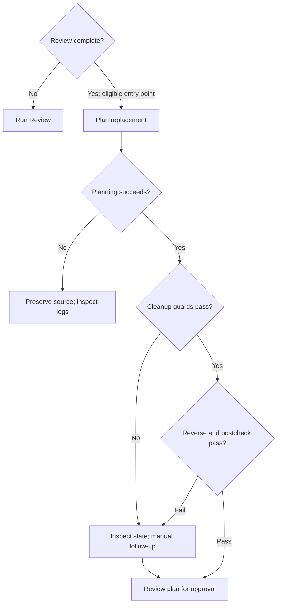

# Workflow

Plan in the branch/worktree you intend to use. Read and approve the task package,
implement inside that scope, validate, then request independent Review.
The [agent contract](../../prompts/prompt_instructions.md) is authoritative;
prompts guide the agent but do not guarantee compliance.

## Architecture of Workflow

```text
${PAW_TASK_HOME:-${XDG_STATE_HOME:-$HOME/.local/state}/paw/tasks}/
  <repo-slug>/
    <task>/
      contract.md          request, exact constraints, context and assumptions
      plan.md              approved scope, checklist, progress and evidence
      metadata.gitconfig   repo/worktree/branch provenance and timestamps
      runs/*.gitconfig     observed command/backend/model/status/exit metadata
    v2-<prefix>-<sha256>-pr.md  seeded when the repo has a PR template
```

Central tasks resolve before legacy `.agent/<task>/` packages. Legacy `pr.md`
remains a fallback when no branch body or ambiguous historical file exists. Branch
bodies use a bounded readable prefix and the full SHA-256 of the exact branch name;
linked worktrees share the main repository’s body store. Saved task assignments
determine the branch; invalid or detached assignments require reconciliation.

An old `<branch-name-safe>-pr.md` is never automatically adopted. If PAW reports
one, verify its intended branch and content, copy it to the reported canonical
path **only if absent**, and retain the original. An existing canonical body wins;
retries never overwrite it. Reconcile differing old/new content explicitly.

PR review first selects a unique task-owned `## PR Tracking` record in `plan.md`
or legacy `pr.md`, or metadata in a PR review draft. Shared branch tracking is a
fallback only for one eligible task. If several tasks own or share the PR, reconcile
tracking on the intended task before retrying; prose and fenced examples are not
ownership records. GUI View PR still opens the remote PR for the saved live branch.

Run `paw setup` to exclude `.agent/` through `.git/info/exclude`;
local task docs and metadata are never committed. Migration explicitly copies
legacy packages for the selected repos:

```bash
paw task-migrate               # current repo
paw task-migrate ../api ../web
PAW_BROWSE_PAGER=cat paw browse my-task
paw archive my-task           # central tasks; migrate legacy first
```

Archive moves a package under its repo store's `.archive/`, outside active CLI/GUI
lists. [GUI Archived/Unarchive](gui.md#move-a-task-forward) restores without overwriting.
Markdown remains authoritative; metadata supplies identity and observational run state.

## Overall Workflow

```bash
paw plan my-task "Add the requested behavior with a focused regression."
paw browse my-task
paw edit my-task "Clarify the acceptance criteria."
# Approve the reconciled plan:
paw implement my-task
paw review my-task
# If a complete review calls for replacement:
paw prototype my-task "Preserve the public behavior; address each review blocker."
# Review the replacement plan before approving its later implementation.
```

[README lifecycle diagram](../../README.md) shows the short path.
[CLI reference](cli-reference.md) owns syntax/options; [GUI](gui.md) owns dashboard journeys.

## What The Task Package Owns

### Required follow-up answer workflow

```markdown
- Which output format is required?
  - USER ANSWER (UNRESOLVED):
```

After the user replies, replace the answer line with
`  - USER ANSWER (PROVIDED): <answer>` and run `paw edit <task>` to reconcile it.
Implement/diagnose refuse either marker anywhere in `plan.md`. Tighten can work
with existing placeholders; `plan.md` remains the approved source of truth.

### Implementation checklist discipline

Use enough vertical slices for the scope. For behavior changes repeat red-green-refactor:
one behavior-focused failing test, one implementation to pass it, then the next slice.
Defer test cleanup until that loop is complete. When finishing a checkbox, add its
adjacent Progress note in the same edit before moving on:

```markdown
- [x] Deliver the version flag and its behavior test.
  Progress: --version prints the expected version; version-output test passes.
```

`paw lint` checks required sections/status and adjacent progress. The working surface
budget is 350 lines, default-on (`PAW_LINT_LENGTH=0` disables length enforcement);
move completed detail with `paw compact <task>`. PAW owns repo-level `.agent/cost-log.md`.

```markdown
## Current Status

- Plan position: Approved implementation and final validation complete.
- Estimated completion: 100%
- Next work: Review.
```

Use a bare integer percentage. At 100%, Next work is `Review.` with only a genuinely
important follow-up if needed. [Testing](testing.md) owns the targeted-to-full ladder,
named results and mandatory final full validation. [Quality](quality.md) owns bounded
self-checks and acceptance evidence. Missing required checks block handoff.

### Branch and worktree assignment

PAW records the existing branch/worktree during plan in local Git common-dir metadata;
it creates neither. Saved assignments are shared across sibling worktrees and reused
by task commands when safe. Re-execution in another registered same-repo worktree
requires the current worktree clean except local `.agent/` docs. Unsafe dirty-state
clobbering, auto-detachment, invented/unborn branches and cross-repo/common-dir hops
stop for manual correction.

`paw implement-batch task-a task-b` preflights the entire selection before launch:
missing, duplicate, completed, running or answer-blocked tasks reject the batch.
Each child uses normal implement. PAW supplies no scheduler/conflict resolver;
use separate branches/worktrees for overlapping work and inspect child outcomes.

### Local GUI

See [GUI start/stop, repo selection, queue and recovery](gui.md).

### A `paw implement` run in detail

CLI → task/assignment guards → launch banner → backend → updated task docs/results.
Backend completion alone does not prove validation or production readiness.
Successful runs may capture verified cleanup provenance; see below.

### Implementation handoff and review grades

Replacement planning creates a plan for a later `paw implement` run. Once approved
implementation, documentation, tests and final full validation pass, record 100%
and `Next work: Review.`. Independent grading and inherited production quality
thresholds belong in the subsequent Review stage; 100% describes implementation
completion, not production sign-off. Self-checks and genuine blockers remain part
of implementation. Reconcile explicit conflicting old approved gates per task;
existing task histories are not automatically rewritten.

Reviews should write plain metadata, for example `- Grade: B+` under
`## Review Metadata`, with explanations and threshold results in separate fields.
The GUI also reads case-insensitive A/B/C/D/F grades with optional plus/minus,
one balanced bold, italic or backtick wrapper, and an optional final period.
Supported grades share badge text, color and prototype eligibility (A- or higher
blocks prototype). Pending/empty grades have no badge; unsupported values remain
escaped neutral text without a guessed rank. Review files are preserved.

## Review completion and inherited findings

New plans follow [Quality policy version 1](quality.md): A- / no production
blockers at independent Review, a criterion/check/evidence table, and bounded
risk-specific self-checks before final full validation. Explicit inherited thresholds
remain authoritative. Unversioned plans are not retroactively rejected.

`paw review` alone seeds [templates/review.md](../../templates/review.md), selected
from `$PAW_HOME/templates/review.md`, for central and legacy packages. Plan and
prototype creation do not seed reviews. Loading and validating the required runtime
slots, pending metadata and section shape precedes any review/history/attempt
mutation; missing, unreadable or malformed resources stop before backend launch
with the resource path. There is no embedded fallback skeleton.

Fill the template's verdict, blockers, evidence, design, improvements and recommendations.
Keep seeded identities unchanged; record the review date and threshold source.
Broader workflow grades and cleanup assessments need a scope reason when unassessed.
Use stable finding IDs and retain inherited origins and resolution evidence; recommendations
reference those IDs. Separate inspected historical outcomes from fresh review checks,
including named commands, tiers, logs and code identities. Missing original logs and
failed checks stay visible; only explicit successful same-name reruns supersede failures.
The [filled review](../example-task/review.md) is hypothetical, not PAW validation evidence.
These producer conventions do not add requirements to accepted historical records
or change the separate GitHub `paw pr-review` comment-draft format.

Review completion requires matching task identity, resolved scope, a recognized
grade, explicit threshold/result and a blockers disposition (list or None). New
attempts also carry policy version, attempt and reviewed code identity, and an
explicit completion marker. A backend returning zero with pending content fails;
failed/interrupted attempts cannot reuse prior success. `paw review` preserves prior
bytes in collision-safe `review-history/` files before seeding a fresh attempt;
archival failure stops without overwriting the prior review. Legacy records remain
readable, but incomplete records need **Run Review** before replacement planning.
Completion checks establish structure, not truth, coverage or production sign-off.

CLI prototype accepts complete adverse reviews and explicit complete high-grade
requests. GUI row/detail/POST additionally restrict A- or higher; that existing
product distinction remains. Pending, unknown-grade, stale and interrupted reviews
cannot authorize replacement seeding or cleanup. Source evidence is checked again
before cleanup; changed evidence stops the run. Existing cleanup ownership,
content/index and idle-worktree guards still apply.

Replacement prompts resolve same-repo sources and ancestors from active central,
archived central or legacy packages. Recorded paths must match repo/task identity;
missing, ambiguous, escaped or cross-repo evidence and lineage cycles block planning.
Archive moves preserve source content. Each blocker needs a finding → invariant →
acceptance/test mapping; non-blockers need planned, deferred-with-reason or
resolved-with-evidence dispositions. Preserve all origins when deduplicating shared
findings. A better grade never silently resolves a blocker; scope conflicts require
reconciliation. Missing evidence never authorizes discarding retained source work.


| Source review | CLI prototype | GUI row/detail/POST |
|---|---|---|
| Missing, pending, malformed, stale, interrupted or unknown grade | Refuse | Run Review; refuse prototype |
| Complete adverse review below A- | Allow replacement planning | Allow replacement planning |
| Complete A- or higher, explicit replacement request | Allow | Disable/refuse |

### Prototype cleanup



Planning success and cleanup success are separate: `paw prototype` exits zero
when planning succeeds, including blocked/unavailable cleanup. A cleanup failure
must remain visible and does not erase the replacement plan or grant permission
to discard retained source work.

- Successful `paw implement` runs save a checksum-verified `prototype.patch` with full blob identities, result bytes, deletions and modes, plus baseline/index metadata and `paw.prototype-owned-path` entries. Pre-existing dirty paths are excluded; resumed runs invalidate previous cleanup authority. Missing or ambiguous evidence records `paw.prototype-provenance-status/message` instead. Provenance statuses are `recorded`, `no-owned-paths`, `blocked`, and `unavailable`. The local manifest uses `paw.prototype-patch-hash`, `paw.prototype-patch-head`, and `paw.prototype-index-contract=baseline-v1`.
- Metadata keys `paw.prototype-source`, `paw.prototype-review`, `paw.prototype-status`, and `paw.prototype-cleanup-message`, and the source’s `paw.prototype-replacement` path let the GUI show lineage and cleanup state without parsing Markdown.
- `paw prototype` creates the replacement plan first and exits zero when planning succeeds. Automatic cleanup requires the saved patch checksum, baseline and current content/modes to match, the entire index to equal the saved baseline, and no unowned tracked changes or untracked non-`.agent` files. It reverses the verified saved patch and checks the worktree/index postcondition. Legacy path-only metadata never authorizes cleanup. Blocked/unavailable cleanup preserves the replacement package and exposes a manual-follow-up reason through `paw.prototype-status` and `paw.prototype-cleanup-message`. Replacement statuses are `planned-source-reverted`, `planned-revert-blocked`, or `planned-revert-unavailable`; source statuses omit `planned-`.
- Supported cleanup includes tracked binary content, deletions, executable modes, spaces, tabs, Unicode, quotes and literal pathspec characters. Newline paths, symlink/directory results, content-normalizing attributes or enabled `core.autocrlf`, staged changes, and ambiguous renames block. Git enumeration or metadata failures never grant cleanup permission.
- For manual recovery, inspect `prototype.patch`, `git diff`, and `git diff --cached`; preserve unrelated edits and remove only reviewed source changes. Never populate path-only metadata to force cleanup. Keep the worktree idle during capture/cleanup: ordinary Git worktree edits cannot be transactionally locked.


## Troubleshooting Crashes

Run `paw crash-log <task>` and inspect the classification and stderr.
[CLI diagnostics](cli-reference.md#crash-log-paw-crash-log) lists codes and telemetry.
On context-pressure warnings, keep updates lean, archive stale detail with
`paw compact <task>` and split growing work. Resume interrupted approved work
with `paw implement <task>` after checking state.

## Recommended Review Before Merging

```bash
paw pr-submit my-task           # draft PR from branch body; requires gh
paw pr-review 123               # first: save draft; later: submit saved review
paw pr-address-comments 123     # plan only
paw implement 123-review        # after approval
paw to-issues my-task           # review drafts before --publish
```

### Before Committing

Inspect `git status`, `git diff`, `git diff --cached` and the resolved contract/plan.
Confirm scope matches approval, durable docs are current, named final evidence is
recorded, completed checkboxes have Progress, local notes remain untracked and the
branch PR body reflects the final change. Record scope deferrals or contract conflicts.
Run `paw lint <resolved-task-dir>`. The human owns commits.

### Before Merging

Review the draft PR and any follow-up fixes, take ownership of the complete diff,
then request reviewers/mark ready. Independent grading and production sign-off
follow implementation; a completion percentage is not sign-off.
